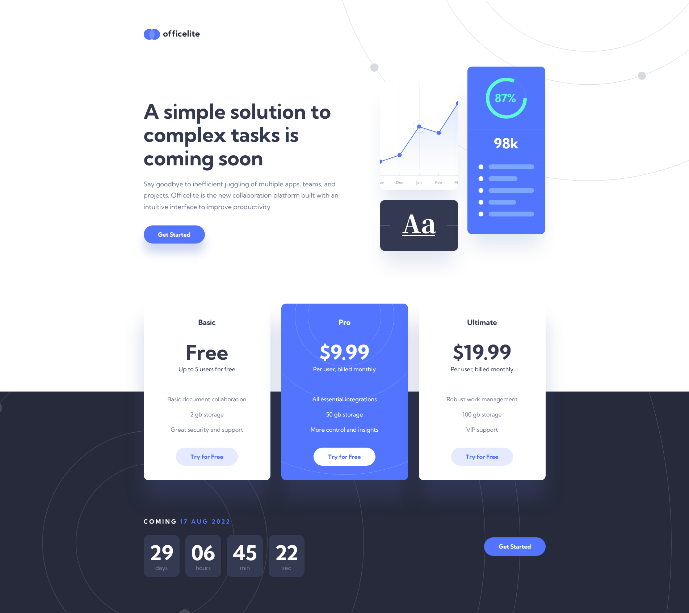
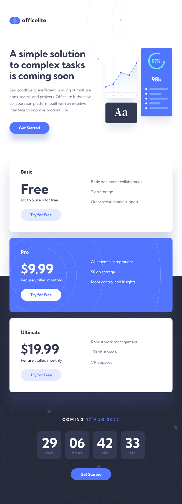
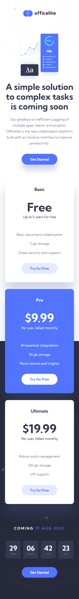

# Frontend Mentor - Officelite coming soon site solution

This is a solution to the [Officelite coming soon site challenge on Frontend Mentor](https://www.frontendmentor.io/challenges/officelite-coming-soon-site-M4DIPNz8g). Frontend Mentor challenges help you improve your coding skills by building realistic projects.

### Screenshot

### Links

- Solution URL: [Add solution URL here](https://your-solution-url.com)
- Live Site URL: [GitHubPages Site](https://karolbanat.github.io/officelite-coming-soon-site/)

### Useful resources

- [Moment.js Docs](https://momentjs.com/docs/)

## Author

- Frontend Mentor - [@karolbanat](https://www.frontendmentor.io/profile/karolbanat)
